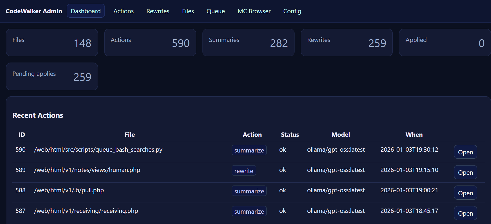
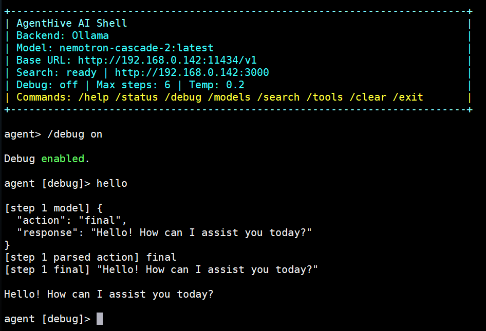

# AgentHive


---

AgentHive is a self-hosted ops memory + AI backend for Linux/web teams: job queues, admin tools, human notes, command history tooling, safe agent runtimes, and API endpoints.
Designed to be one of the first platform layers installed on every server: private by default, LAN-first, and still automation-friendly.

## Why teams install AgentHive
- Keep ops memory local: Human Notes, bash history, search history, and AI enrichments in your own SQLite stores
- Run AI-assisted engineering workflows without giving direct shell execution to the model by default
- Standardize AI provider setup once, then reuse it across tools and agent runtimes
- Expose stable `/v1/*` routes for automations, scripts, and agent-to-agent integrations
- Start simple on LAN, then harden for internet-facing deployments when needed

## What you can do with it
- **Analyze and modernize codebases** with AI-powered CodeWalker (security audits, test strategies, documentation, refactoring)
- Scan and understand legacy projects (older PHP, Python, shell scripts)
- Run an interactive AI engineering shell with local tools, durable memory, and admin-managed dynamic tools
- Run **AI Root Defender**: a read-only diagnostic shell with human-approved command execution
- Build reusable instruction workflows with **AI Templates** under `/admin/AI_Templates/`
- Run queued AI jobs (workers, logs, retries)
- Manage shared AI connections (OpenAI / Anthropic / OpenRouter / Ollama / LM Studio)
- Store and search human notes and operational history
- Expose safe endpoints for automation and agent-to-agent workflows

## Quick start

For a fresh server, visit `http://your-server/admin/admin_installer.php` after deploying. The installer wizard will:
1. Auto-create required `/web/private` subdirectories
2. Check PHP environment and extensions
3. Write `/web/private/.env` with sane defaults
4. Auto-generate and provision `SYSINFO_API_KEY` and `IER_API_KEY` into `api_keys.json`

After install, verify:
```bash
curl -s http://localhost/v1/health | jq
curl -s http://localhost/v1/ping | jq
```

AgentHive is for small teams who want AI assistance without sending their data to the cloud.

AgentHive is not just a note-taking app or just an API.

It’s a **machine memory layer** with **time-aware search history** feeding **AI enrichment**, under a stable `/v1/*` API contract.

This project captures:

- Human notes
- Bash history (separate, faster command-focused workflows)
- Search queries & results (with ranking snapshots)
- AI-generated summaries & metadata
- Human-authored operational logs

…and continuously enriches them using local or external AI models via a `/v1/*`-style API.

## The plan (three pillars)

### 1️⃣ Ops Memory System

Capture operational reality in a way that’s cheap to store, easy to audit, and safe to keep local.

- Logs
- History
- Jobs
- Human Notes
- Incidents
- Decisions

### 2️⃣ AI Assistant Backend

Turn that memory into an assistant via a boring, controllable backend.

- Queues (Mother Queue)
- Workers (tool runner)
- Agents (optional task-level behaviors)
- Models (local-first, external optional)
- Routing (stable `/v1/*` endpoints, including OpenAI-compat shims)

### 3️⃣ Knowledge Vault

Make the captured data usable over time.

- Searchable
- Persistent
- Local
- Private

## Design principles

- **LAN-first by default** (safe on fresh installs)
- **Stateless APIs, stateful memory**
- **SQLite everywhere** (self-bootstrapping schemas)
- **Deterministic paths** (no `/var/www/html` vs `/web/html` drift)
- **Operationally boring** (cron-safe, idempotent, debuggable)

This system replaces:

> “I used to Google this command…”

with:

> “I already *know* this machine.”

---

## What’s included today

- **/v1 API** endpoints (JSON, key + scope auth, rate limited)
- **Human Notes** at `/admin/notes/?view=human`:
  - streamlined note capture where humans paste content and save quickly
  - AI-assisted title + tag creation to reduce manual note cleanup
  - actively replacing older notes workflows
- **Bash History** at `/admin/notes/?view=bash_history`:
  - separated from Human Notes for faster command search and review
  - tuned for shell-history lookup instead of general note browsing
- **Chat routing** at `/v1/chat/` (autoselector) and `/v1/chat/completions` (OpenAI-compatible shim)
- **Admin tools** under `/admin/` (protected with a “bootstrap token” flow to avoid fresh-install lockouts)
- **AI Agent Shell** under `/admin/AI/`:
  - split Python agent modules with file-backed boot prompt
  - shared AI backend resolution from PHP settings
  - slash-command shell (`/help`, `/status`, `/models`, `/search`, `/memory`, `/tools`)
  - dynamic approved tool bridge into `/web/private/db/agent_tools.db`
  - optional durable memory store in `/web/private/db/memory/agent_ai_memory.db`
- **CodeWalker** — AI-powered codebase analysis and modernization tool
- **AI Root Defender** under `/admin/AI_Root_Defender/`:
  - read-only Linux/webserver diagnostics with command governance
  - deterministic turn loop (`continue`, `needs_input`, `final`)
  - human approval gate before command execution
  - proposal/audit history stored in `bh/` for reviewability
- **AI Templates** under `/admin/AI_Templates/`:
  - template editor and registry for reusable prompt/instruction envelopes
  - deterministic variable compilation and portable JSON backup flow
  - provider-agnostic structure for consistent runs and easier debugging
- **Admin module scaffold** under `/admin/`:
  - use `admin/admin_*.php` entrypoints to add focused custom admin modules quickly
  - works well with the existing protected admin console workflow
- **MotherQue admin area** moved to `/admin/AI_MotherQue/`
- **AI Story** collaborative narrative engine:
  - Admin UI: `/admin/admin_AI_Story.php`
  - API routes: `/v1/story/create`, `/v1/story/turn`, `/v1/story/list`, `/v1/story/relay`
  - Choice-first turns (`A/B/C/Wildcard`) with optional note override
  - Optional `story_*` Agent Tools integration (dice/twists/resource helpers)
  - Auto-summary compression every 10 turns via `story_summarize` template



### CodeWalker

CodeWalker is an automated codebase analysis system that uses AI to understand, document, audit, test, and refactor your code.

**Key Features:**
- **Multi-Action Analysis**: 6 analysis types with configurable probability distribution
  - 📝 **Summarize** — Generate structured code summaries
  - ✏ **Rewrite** — Refactor code with unified diffs
  - 🔒 **Audit** — Security and vulnerability analysis
  - 🧪 **Test** — Test coverage and strategy recommendations
  - 📚 **Docs** — Auto-generate documentation
  - 🔧 **Refactor** — Architectural improvement suggestions
  
- **Smart Deduplication**: Hash-based file tracking prevents reprocessing unchanged files
- **Randomized Scanning**: Processes different files each run for better codebase coverage
- **Action Distribution**: Configure percentages (e.g., 40% rewrite, 15% audit, 15% test, 15% docs, 15% refactor)
- **Web Dashboard**: View all analyses, apply rewrites, track progress at `/admin/codewalker.php`
- **CLI + Cron**: Run manually or schedule automated scans
- **Multi-Model Support**: Works with OpenAI, Anthropic, OpenRouter, Ollama, or local LM Studio

**Quick Start:**
```bash
# Run on specific file
php admin/codewalker_cli.php --action=audit /path/to/file.php

# Auto-scan with random actions
php admin/codewalker_cli.php --action=auto

# View results
xdg-open http://localhost/admin/codewalker.php?view=dashboard
```

**Configuration:**
Edit settings at `/admin/codewalker.php?view=settings` or via the settings database. Configure:
- Scan paths and file types
- Action percentages and prompts
- AI model selection
- Exclusion patterns

**Database:**
- Settings: `/web/private/db/codewalker_settings.db`
- Results: `/web/private/db/inbox/codewalker.db`

**Cost Efficiency:**
At ~$0.24 per 250 files (using efficient models), CodeWalker provides comprehensive codebase intelligence at scale.

### AI Agent Shell

The new AI shell is a local-first engineering agent that can use built-in tools, durable memory, and approved admin-managed tools.

**Key Features:**
- **Boot prompt file**: behavior is driven by `admin/AI/agent_boot.md`
- **Split runtime modules**: `agent.py`, `agent_runtime.py`, `agent_config.py`, `agent_shell.py`, `agent_common.py`
- **Shared AI config**: follows the same active backend/model chosen in `/admin/admin_AI_Setup.php` unless overridden
- **Runtime profile**:
  - template: `admin/AI/default_agent.json`
  - private override: `/web/private/agent.json`
- **Tool settings**:
  - `/web/private/agent_tools.json`
  - includes search, DB-backed agent tools, and durable memory settings
- **Durable memory**:
  - `memory_search` and `memory_write`
  - SQLite DB at `/web/private/db/memory/agent_ai_memory.db`
  - optional startup preload of recent entries
- **Dynamic tool bridge**:
  - reads approved tools from `/web/private/db/agent_tools.db`
  - supports `php`, `python`, and `bash`
  - exposes `agent_tool_list` and `agent_tool_run`
- **Interactive shell**:
  - styled TTY banner
  - slash commands for backend status, search status, memory status, approved tool listing, and manual startup greeting
  - optional startup greeting warmup to load local models before normal tool-loop runs

**Admin Pages:**
- `/admin/AI/` — landing page for the agent area
- `/admin/admin_AI_Memory.php` — durable memory manager and memory runtime settings

**REPL examples:**
```bash
python3 /web/html/admin/AI/agent.py

# inside the shell
/status
/tools list
/mem list
```



### AI Root Defender

AI Root Defender is a local-first diagnostic shell built for production safety: the model can investigate and propose commands, but execution remains behind a human approval gate.

**Key Features:**
- **Read-only command policy**: blocks dangerous patterns (no chaining, redirects, pipes, or `sudo`)
- **Approval workflow**: proposed commands are approved/rejected by a human before execution
- **Deterministic turns**: consistent `continue`, `needs_input`, and `final` state loop
- **Auditability**: proposal + execution history persisted in `bh/` with event mirroring
- **Provider profiles**: supports local OpenAI-compatible backends plus hosted providers
- **Non-interactive mode**: one-shot JSON runs plus cron-friendly task queue processing from `/web/private/guardian_tasks/`
- **Context visibility**: estimates prompt/output token usage after runs to help with smaller models

**Quick Start:**
```bash
cd /web/html/admin/AI_Root_Defender
./bin/install.sh
source ./activate.sh
python3 agent_bash.py
```

See `/web/html/admin/AI_Root_Defender/README.md` for non-interactive mode, task-file queues, config model, and safety details.

### MotherQue

MotherQue assets now live under `/admin/AI_MotherQue/`.

**Current layout:**
- `admin/AI_MotherQue/index.php`
- `admin/AI_MotherQue/README.md`
- `admin/AI_MotherQue/scripts/`
- `admin/AI_MotherQue/codewalker.png`

### AI Story quick notes

- Story data lives in SQLite at `/web/private/db/memory/story.db` (auto-created).
- Load default templates from `/admin/admin_AI_Templates.php` using **Import Defaults**.
- Default templates file path is `admin/defaults/templates_ai_templates.json`.
- Story templates should use `story_` prefixes to keep them isolated from non-story templates.
- Recommended baseline templates:
  - `story_skynet_narrator`
  - `story_skynet_dm`
  - `story_skynet_tutorial`
  - `story_summarize`
- `story_summarize` is invoked every 10 turns to compress long history into `stories.summary`.
- For stateful progression, stories should maintain structured `world_state` (for example: `health`, `danger_level`, `location`, `ammo`, `resources`).

---

## PHP compatibility

Target floor is **PHP 7.3**. No 7.4+ or 8.x features are used:
- No arrow functions, typed properties, `??=`, or numeric underscore literals (`1_000`)
- No named arguments, `match`, `?->`, union types, or `str_contains`
- Polyfills for 7.3 gaps live in `lib/bootstrap.php`

---


---

## Quick start (existing server)

1) Point your webserver docroot at this folder (example: `/web/html`).

2) Create your private directory:

```bash
sudo mkdir -p /web/private
sudo chown -R www-data:www-data /web/private
sudo chmod 0750 /web/private
```

3) Create `/web/private/.env`:

```bash
cat >/web/private/.env <<'EOF'
# --- Service identity ---
APP_VERSION=dev

# --- Security ---
# lan (default) allows RFC1918+loopback keyless access; public requires keys for all requests
SECURITY_MODE=lan

# Optional: explicit allowlist for keyless access (comma-separated CIDRs/IPs)
# ALLOW_IPS_WITHOUT_KEY=192.168.0.0/24,127.0.0.1/32

# Only used when SECURITY_MODE=lan
# REQUIRE_KEY_FOR_ALL=0

# --- API keys file ---
# API_KEYS_FILE=/web/private/api_keys.json

# --- Optional: override where private data lives (bootstrap will auto-detect if not set) ---
# PRIVATE_ROOT=/web/private
EOF
```

4) Run the installer to provision API keys and finish setup:

- Visit `http://your-server/admin/admin_installer.php`
- Or manually create `/web/private/api_keys.json`:

```bash
cat >/web/private/api_keys.json <<'EOF'
{
	"change-me": {"active": true, "scopes": ["chat","tools","health","inbox"]}
}
EOF
sudo chown www-data:www-data /web/private/api_keys.json
sudo chmod 0640 /web/private/api_keys.json
```

5) Hit health:

- `GET /v1/health` (should return JSON)
- `GET /admin/notes/?view=human` (Human Notes UI)
- `GET /admin/notes/?view=bash_history` (Bash History UI)

---

## Security model (important)

### API guard (`lib/bootstrap.php`)

API routes call `api_guard()` / `api_guard_once()` which:

- extracts key from `X-API-Key` or `Authorization: Bearer ...`
- loads scopes from `api_keys.json`
- enforces per-IP and per-key rate limits

### Security knobs (no server-specific edits)

Configured via `.env`:

- `SECURITY_MODE=lan|public`
	- `lan` (default): allows keyless access from RFC1918 + loopback
	- `public`: keys required for all requests — **use this for internet-facing servers**
- `ALLOW_IPS_WITHOUT_KEY` (comma-separated CIDRs/IPs, only used in `lan` mode)
- `REQUIRE_KEY_FOR_ALL=0|1` (only applies when `SECURITY_MODE=lan`)
- `SYSINFO_API_KEY` — dedicated key used by `root_sysinfo_local.sh` sender; provisioned automatically by installer
- `IER_API_KEY` — secondary key for inter-server calls; also provisioned automatically by installer

### Admin auth (non-bricking fresh installs)

Admin pages use `lib/auth/auth.php`.

Design goal: a fresh install should not lock you out.

- On first run, a one-time bootstrap token lives at `${PRIVATE_ROOT}/bootstrap_admin_token.txt`
- You can "claim" admin from LAN or with `?bootstrap=<token>`
- After creating your first admin account, you are redirected to the installer to finish setup
- After an admin exists, normal session login applies

---

## Data + storage layout

This repo intentionally separates **code** from **private data**.

- Code: this repo (example: `/web/html`)
- Private data: `${PRIVATE_ROOT}` (default: `/web/private`)
	- `.env`
	- `api_keys.json`
	- SQLite DBs
	- rate-limit state: `${PRIVATE_ROOT}/ratelimit`

The git ignore policy is set up so you don't accidentally commit private data.

---

## Repo structure (high level)

- `lib/`
	- `bootstrap.php` (paths, env loader, API guard; defines `APP_SOURCE_SCRIPTS` and `PRIVATE_SCRIPTS` path constants)
	- `ratelimit.php` (file+flock sliding-window limiter; stores under `${PRIVATE_ROOT}/ratelimit`)
	- `auth/auth.php` (admin bootstrap-token auth)
- `v1/`
	- API endpoints and apps, generally using the "directory route" form: `v1/<route>/index.php`
- `src/scripts/`
	- Version-controlled original scripts; deployed to `${PRIVATE_ROOT}/scripts/` as executable wrappers via `root_update_scripts.sh`
	- **Source path is always `APP_ROOT/src/scripts` — not configurable per-server**
	- **Wrapper path is always `PRIVATE_ROOT/scripts` — not configurable per-server**
- `admin/`
	- Admin tools (protected)
	- `admin_*.php` pattern for quickly adding custom single-file admin modules
	- `AI/` split Python agent shell + prompt/config docs
	- `AI_MotherQue/` queue UI and scripts
	- `admin_installer.php` — step-by-step setup wizard (auto-creates dirs, sets env, provisions API keys)
	- `admin_AI_Setup.php` — primary AI provider/model configuration
	- `codew_config.php` — CodeWalker settings including AI base URL and search endpoint
	- `admin_API_Search.php` — search endpoint configuration (shared with Python workers via CodeWalker settings DB)

---

## Troubleshooting

### “500 Internal Server Error”

Check Apache error logs (Ubuntu/Debian):

```bash
tail -n 200 /var/log/apache2/error.log
```

Common causes in this repo:

- missing / incorrect `${PRIVATE_ROOT}` permissions for the web user
- missing includes after route refactors (e.g. old `__DIR__/lib/...` paths)

### API returns 401 / unauthorized

- Ensure `${PRIVATE_ROOT}/api_keys.json` exists and is readable by the web user.
- If running `SECURITY_MODE=public`, all non-unguarded endpoints require a key.

---

## Docs

- `admin/AI_Root_Defender/README.md` — safe diagnostic shell, approval flow, and non-interactive/task queue usage
- `admin/AI/README.md` — interactive AI agent shell runtime, tools contract, and profile model
- `admin/AI_Templates/README.md` — template system concepts, compilation model, and tests
- `admin/AI_MotherQue/README.md` — queue/admin area runtime notes
- `admin/notes/README.md` — Human Notes and Bash History behavior, storage, permissions, and LAN guard details
- `PROVIDER_CONFIG_GUIDE.md` — provider setup across OpenAI/Anthropic/OpenRouter/Ollama/LM Studio/custom
- `bootstrap.md` — deeper notes on bootstrap behavior and config
- `copilot-instructions.md` — repo conventions and operational guidance

---

## Roadmap (aspirational)

The TurnKey AI appliance is a roadmap direction; this repository currently provides the core LAN-first service layer that also runs on Ubuntu and nginx-php-fastcgi.

### Core idea (normalized)

TurnKey Linux → **TurnKey AI appliance**: a self-hosted, private, LAN-aware AI system for small businesses that installs like an OS, configures itself, and keeps data local by default.

### High-level architecture

AI stack components (plan):

- AI Template → request envelope (model, limits, rules)
- AI Templates → editable prompt blueprints
- AI Compiler → renders templates
- AI Engine → calls model
- Mother Queue → schedules jobs


1) **Base system**

- Debian stable
- hardened defaults
- no cloud dependencies by default

2) **Install-time console config**

On first boot, guide setup (LAN-friendly defaults):

- show local IP + hostname
- show available models + storage status
- collect business name + primary role
- optional: enable LAN mesh
- optional: allow external AI

Generate:

- API keys
- local TLS
- private memory DBs

3) **Preinstalled structure**

Example layout:

```
/var/www/html      -> UI / Admin
/web               -> Working domain
/web/api           -> Internal + external API
/web/notes         -> Human Notes + AI enrichments
/web/codewalker    -> Self-analysis & refactor
/web/files         -> File browser
/web/memory        -> AgentHive DBs
```

4) **Private domain memory**

- SQLite + (optional) vector DB
- Human Notes + AI enrichments
- code history + decision memory
- sync only when explicitly enabled

5) **LAN mesh (optional)**

- discovery via mDNS / Avahi
- signed keys + opt-in trust
- shared-but-permissioned memory across nodes

6) **External AI (optional)**

- local-only mode (no external dependency)
- hybrid mode (use external AI for heavy summarization, occasional refactors)

## License

Apache License 2.0. See [LICENSE](LICENSE).
